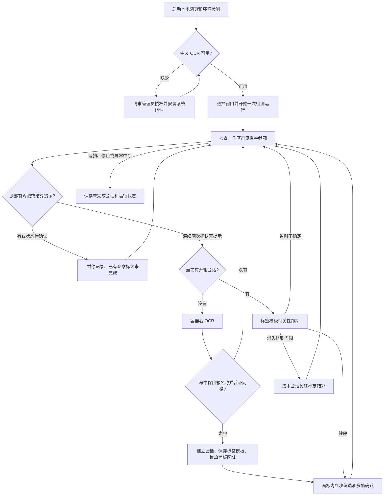
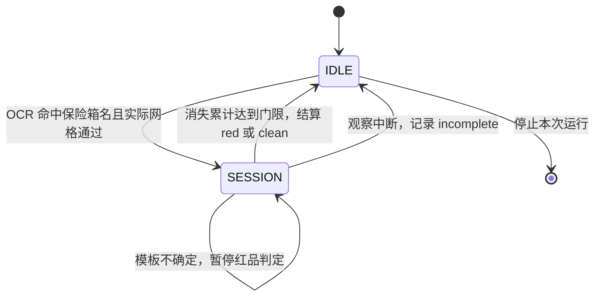

# 暗区红品检测

通过 Windows 屏幕截图识别暗区突围保险箱中的红色稀有度物品，自动记录每次检测运行、开箱会话、出红结果和截图，并提供网页历史记录与人工复核。

当前最新正式版是 **Rust v0.3.6，Windows x64**。**Python v0.2.2 暂时标记废弃，停止更新；后续只维护 Rust。** 仓库保留 Python 和各历史版本源码用于归档。实现采用 Windows OCR、图像颜色与几何规则、模板跟踪和多帧确认，识别过程在本机完成。

- [1～6格合成压力测试：当前规则已知失败项](docs/合成格子压力测试.md)
- [最新 Release](https://github.com/lphahapl/arena-breakout-red-detection/releases/latest)
- [Rust v0.3.6 Windows x64 下载](https://github.com/lphahapl/arena-breakout-red-detection/releases/download/v0.3.6/arena-breakout-red-detection-v0.3.6-windows-x64.zip)
- [v0.3.6 竖三格完整框修复与当前重发源码](docs/v0.3.6竖三格完整框修复.md)
- [v0.3.6 两格漏报修复重发：已有 0.3.6 也需重新下载](docs/v0.3.6两格修复重发.md)
- [v0.3.6 修复与发布验证](docs/v0.3.6验证.md)
- [唱片机词表修补验证](docs/唱片机词表修补验证.md)
- [v0.3.5 误报修复验证](docs/v0.3.5验证.md)
- [v0.3.4 崩溃修复验证](docs/v0.3.4验证.md)
- [v0.3.3 验证报告](docs/v0.3.3验证.md)
- [Python 废弃说明](PYTHON_DEPRECATED.md)
- [检测验证报告](docs/验证报告.md)
- [OCR 环境准备验证](docs/环境检测验证.md)
- [源码归档与版本来源](docs/源码归档验证.md)

**2026-10-05 两格修复重发：横向/竖向两格因格线面积损失的漏报已修正；已有 0.3.6 用户也需重新下载。最新重发继续补全竖向三格框，当前源码快照为 `version/v0.3.6-vertical-20261005`；两格修复快照为 `version/v0.3.6-repack-20261005`，原 `version/v0.3.6` 保留首次发布源码。**

**v0.3.6 修复长笛漏报和滑板拖动误报，新增观战/结算暂停记录，并保留旧版误报与后台稳定性修复。建议旧版用户升级，并使用新程序打开的页面。**

### 唱片机词表修补（早期词表更新，v0.3.6 已包含）

当前源码 red_filter.json 已追加完整词语“唱片机”，临时排除物品本体红色图案。此项只更新词表，没有重新打包发布；v0.3.5 原下载包保持不变。已有安装可以在 exe 同目录 JSON 的 exclude_words 内追加“唱片机”，保留其它自定义词，再停止并开始检测，不需退出程序。正在运行的任务继续使用启动快照。词语筛选依赖 OCR 读到名称；正式 v0.3.5 exe 的图像识别仍沿用发布时的网格与色彩规则。

### v0.3.6：长笛、滑板与观战状态

v0.3.6 新增长条红品识别、槽位边缘验证及观战/结算暂停记录。长笛暗红背景与选中背景被旧颜色、尺寸和宽高比门限遗漏；滑板拖动图标的红色花纹曾被当作稀有度背景。现在允许细长槽位并校验候选与实测网格的对齐，不依赖滑板名称 OCR 排除。

`observer.rs` 检查所选游戏窗口底部中央，任一 OCR 行包含“观战”或“结算”立即暂停新开箱记录。页面显示当前状态；连续两次确认提示消失后恢复。自己正在观察的会话若被观战/结算打断，只保存一条未完成，不计入出红率；观战中不会建立新会话。工作区和底部状态区都必须可见。

上述修复已打包为正式 v0.3.6。旧版需下载新版程序才能获得算法和状态功能；修改 JSON 无法更新编译进 exe 的逻辑。[原因与验证记录](docs/长笛滑板与观战状态修复验证.md)。历史自动判定和人工复核均不改写。

## 1. 使用方式与统计范围

### 直接运行 Rust 发布版

1. 下载分享包并解压，双击 `暗区红品检测.exe`。
2. 浏览器自动打开本机控制页面；等待中文 OCR 环境检测完成。
3. 选择游戏窗口，点击“查看预览”，确认工作区覆盖的是右侧被搜索的保险箱。
4. 点击“开始检测”，让保险箱搜索面板保持可见，并等待游戏搜索完成后再关闭面板。
5. 点击“停止记录”结束本次检测；“运行历史”可查看每次运行、截图和人工复核。
6. Rust 版的“退出程序”会结束检测并退出后台进程；单独关闭网页会保留后台程序。

发布程序无需 Python、Rust、OpenCV 或 Visual C++ 运行库。首次运行如果缺少系统简体中文 OCR，会发起系统组件安装，需要联网并允许 Windows 管理员授权；系统也可能要求重启。

### 什么会被计数

| 情况 | 当前行为 |
| --- | --- |
| 右侧目标面板出现包含“保险箱”的容器名 | 可以建立一个开箱会话 |
| 保险箱内出现符合规则的红色稀有度物品 | 多帧确认后记住“本会话见过红品” |
| 左侧背包已有大金 | 默认工作区不包含左侧背包 |
| 地上拾取或其他容器的物品 | 不属于默认保险箱识别目标；仍需正确设置工作区 |
| 一次开箱出现多个红品 | 出红保险箱次数增加 1，不按物品数量增加分子 |
| 同一个保险箱关闭后再次打开 | 可能再次计数，当前不做同箱去重 |
| 识别到观战或结算提示 | 暂停建立开箱会话，已有观察按未完成保存 |
| 停止检测或窗口遮挡时面板仍打开 | 记录为未完成，不加入出红率分母 |
| 已经确认有红，但随后观察被中断 | 该会话仍按未完成记录，可保留见红信息和供人工复核 |

这里的“完整结算”指工具观察到会话自然结束。**程序当前没有独立识别游戏的“全部物品搜索完成”标志**：如果提前关闭一个仍在搜索的保险箱，工具也可能将它自然结算为无红。使用时应等待搜索完成后再关面板。

程序识别的是屏幕上可见的界面。选中播放游戏录像的浏览器时，也会把录像中的保险箱当作输入；它不会验证当前输入是否来自真实游戏进程。

## 2. 当前 Rust 与归档 Python 是怎么写的

下表保留历史实现对照。当前功能在 Rust 开发；Python 源码、页面和 v0.2.x 发行版均已冻结。

| 层 | Python 实现 | Rust 实现 |
| --- | --- | --- |
| 截图与窗口 | `capture.py`：Windows 窗口 API + `mss`，截图转为 BGR 数组 | `native/src/capture.rs`：Windows 窗口 API + GDI 桌面截图 |
| OCR | `ocr.py`：Python WinRT 投影调用 `Windows.Media.Ocr` | `core.rs`：直接调用 Windows WinRT OCR |
| 图像处理 | NumPy / OpenCV 的 HSV、形态学、连通域和模板匹配 | Rust 实现 HSV、形态学、连通域与局部采样相关性匹配 |
| 会话与红品确认 | `track.py`：`Tracker` 状态机 | `core.rs`：`Tracker` 状态机 |
| 检测运行器 | `runner.py`：后台检测线程、状态、截图和事件记录 | `main.rs`：后台检测线程、状态、截图和事件记录 |
| 本地网页 | `webui.py` / `history_ui.py`，标准库 HTTP 服务 | `tiny_http`，HTML 资源编译进 exe |
| 持久化 | `storage.py`：Python `sqlite3` | `storage.rs`：`rusqlite`，SQLite 编译进程序 |
| 环境准备 | `environment.py` 执行共享 `environment.ps1` | `environment.rs` 执行内嵌的同一份 PowerShell 安装逻辑 |

Rust 版内嵌网页、数据库依赖和图片编码，发布时只需 exe、默认规则 JSON 与使用说明；`.cargo/config.toml` 配置静态 CRT。Python 便携版内置解释器和调用库；运行仓库源码时需自行安装 `requirements.txt`。

两版遵循相同的业务规则，但图像计算实现有差异。Python 使用 OpenCV；Rust 的模板相关性使用局部采样，连通域与形态学也由自身实现，不能假定所有边界像素或分数逐位相同。两版都需要真实截图和视频样本回归。

## 3. 从截图到结果的主链路



当前 Rust 发布版以容器名 OCR 与实际网格联合建立会话，以标签模板判断存活。Python `detect.py` 为冻结归档；Rust v0.3.5 的网格验证由 `native/src/core.rs` 实现。

### 3.1 工作区与窗口可见性

默认抓取选定窗口客户区的右侧 40%，降低左侧背包红品的干扰。`work_region` 可指定 `[x, y, width, height]`，四项为相对客户区的归一化比例。

检测时在工作区内取 5×5 个采样点，判断这些点上方的根窗口是否属于目标窗口。至少约 60% 的采样点可见才继续分析。该策略允许游戏和网页分别位于两块屏幕；单纯“游戏不在前台”不等同于被遮挡。

选定窗口不存在时不会静默改为抓取其他前台窗口。可见性检查是采样近似，并不能识别所有很小的遮挡；应先用预览确认范围，避免网页盖住游戏。

### 3.1.1 游戏状态检查（v0.3.6）

状态区域按整个游戏客户区的 `[0.20,0.88,0.60,0.12]` 裁剪，覆盖底部中央提示，不使用右侧保险箱工作区。每约 0.5 秒调用 Windows OCR；原尺寸没有关键词时再尝试 1.5 倍，并按系统 OCR 最大图像尺寸限制缩放。新会话开始或自然结算前，若本轮没有检查底部，会额外检查，避免缓存的正常状态放入观战开箱事件。

任意命中“观战”或“结算”立即暂停；两者都有时显示观战。启动先检查状态，连续两次无命中后才开始或恢复。底部被遮挡不会被当作提示消失，恢复确认从零开始；暂停期间跳过容器 OCR 和红品分析，约每 0.25 秒循环。API、逐帧日志和运行耗时摘要保留状态、命中关键词及状态 OCR 耗时，不保存底部截图。OCR 漏读、游戏提示位置变化仍可能影响门控，需用实际截图复核。

### 3.2 容器名 OCR 与锚点

空闲时寻找以关键词 `保险箱` 结尾、规范化后长度不超过 8 字的 OCR 行；拒绝包含等待、出现、打开、检测、记录、次数、搜索、寻找等动作或状态文字的行。随后验证标题下方的实际物品网格：靠近标题左缘存在至少三条等距、较长、低饱和度且与两侧背景有亮度差的竖线。没有网格不会建立会话，即使网页单独显示“保险箱”也不满足条件。去掉空白可以处理 Windows OCR 在汉字之间插入空格的情况。

OCR 先尝试原尺寸，再在未命中时尝试 1.5 倍放大；命中后停止额外的名称识别。名字矩形成为面板锚点，并用于：

- 推算物品搜索区域，避免在整张游戏画面上找红色。
- 截取名字标签及其背景作为模板，跟踪当前面板是否仍在。
- 定位红色容器标题背景，在红块识别时排除。
- 在标题下方测量实际槽位边长，过滤过小或过大的红块；测量结果按锚点缓存，不在每帧重新测量。

名字锚点 `(nx, ny, nw, nh)` 推算的面板区域约为：`x=max(nx-16×nh,0)`、`y=max(ny-2×nh,0)`、`width=nw+32×nh`、`height=18×nh`；实际裁剪受工作区边界限制。这是测量失败时使用的经验范围。当前版本还按实际网格间距查找连续横线和竖线交点，用实测底边补足高度；遇到缺失行边界停止，不直接扩大到整个工作区。检测与保存截图使用相同面板范围，网格结果按锚点缓存。

空闲时保留上次名字位置，优先在附近查找；默认小区域探测间隔不长于 0.2 秒，并约每 1 秒允许重新扫工作区。没有可用位置时名称 OCR 的默认间隔为 0.5 秒。名称误读或过短的面板展示仍可能使会话无法建立。

### 3.3 开箱会话状态机

“一次运行”是从点击开始到停止的一段检测任务；“一次会话”是该运行内一次被观察到的保险箱打开过程，一次运行可以有多个会话。



会话开始时立即扫描一次红块，兼顾“启动检测时面板已打开”的场景。之后主要用标签模板的归一化相关性 NCC 判断存活，避免同一名称偶发 OCR 误读把一个箱子拆成多次。

| 模板分数 | 状态处理 |
| --- | --- |
| `score ≥ 0.65` | 面板健康，清空消失与灰区计数，允许红品判定 |
| `score < 0.35` | 增加一次消失计数 |
| `0.35 ≤ score < 0.65` | 进入灰区；连续达到 5 轮后开始增加消失计数 |
| 消失计数达到 3 | 自然结束当前会话，按见红标志结算 |

模板未达到健康阈值时，即使暂时还没有结算，也不接受该帧的红品证据；同时向多帧窗口加入空观察。这可以防止面板关闭后把建筑、天空或地面当作物品。

## 4. 怎样判断“出红”

检测针对物品槽位的红色稀有度背景。价格文字、物品价值和完整物品名都不是建立“出红”结果的必要条件，当前也没有按价格门槛判断大金。

### 4.1 红色像素与形状筛选

以下为 v0.3.6 的默认值；旧版 v0.3.5 仍保留发布时的门限。先将图像转换到 HSV。下面的 H 按 OpenCV 的 0–179 尺度表示，S/V 为 0–255；Rust 实现使用相同尺度。

| 分支 | 默认像素条件 |
| --- | --- |
| 普通红底 | `H≤9 或 H≥170`，`S≥55`，`V≥40`，`abs(G-B)/max(G,B,1)≤0.28`；`V<100` 时另外要求 `H≤6 或 H≥174` |
| 亮色高亮红底 | `H≤9 或 H≥170`，`S≥20`，`V≥180`，`abs(G-B)/max(G,B,1)≤0.08` |

亮色分支补充选中时偏浅粉色的槽位；暗红分支降低亮度和饱和度下限，同时保留暗色暖色相限制，避免重新接受棕色底色。

容器标题的背景同样可能是红色。代码在**闭运算之前和之后**都清除标题区域，避免标题与普通物品通过形态学处理连接成一个大块。用户提供的“电子保险箱 + 太阳能充电器”误报就是这类连接问题，不能仅凭价格较低来排除。

默认 25 像素闭运算用于连接被物品图案切开的背景。连通域随后按以下规则筛选：

- 红色面积占面板面积至少 0.25%。
- 填充率，即红色面积 / 外接框面积，至少 0.30。
- 外接框宽高比在 0.22 与 4.5 之间，支持三格或四格长条红品。
- 从实际网格测量格子边长；候选宽高各至少 0.9 格（容忍格线边框）、宽高按实测格边长四舍五入后的格数乘积至少两格，外接框面积至少 `2×0.9²` 格（每边 10% 边框容差），单边不超过四格。正常会话要求实际网格存在；直接 `--panel` 诊断无法测量网格时才用名字高度四倍作为回退。

v0.3.6 进一步要求候选四边中至少三边靠近实测网格边界，容差为格子边长 12%（至少 4 像素），允许物品提示遮住一边。横线必须与至少两条竖线相交，避免将标题分隔线当作网格起点；横线无法可靠测量时保守要求左右两边对齐。拒绝原因写入候选 `槽位边缘不对齐`。此规则用于区分槽位背景与悬浮拖动图标，本次没有添加滑板排除词。

v0.3.4 曾将名字高度三倍当作格子边长：15 像素字高被算成 45 像素格子，实际 64×64 的单格提示面积 4096 却超过两格门限 4050，造成误报。v0.3.5 实测约 64 像素后，两格门限约 8192，单格被拒绝。棕色笔记本底色的 H=8–9、V≈74–76 落在旧普通红色分支中；新版收紧暗色暖色相，同时保留明亮高亮分支。

这些尺寸约束来自现有样本和界面比例，属于规则假设。新增物品、单格红稀有度物品、UI 缩放或颜色表现变化，需要用新样本复核，不能将当前阈值视为覆盖所有未来物品的保证。

### 4.2 多帧确认和物品文字排除

颜色和形状通过后，仍需满足时间与位置条件：

1. 保留最近 5 次观察的候选矩形。
2. 当前候选必须在至少 2 次观察中与相同位置的候选重叠，IoU 至少 0.3；每帧最多贡献一票。
3. 在不同位置各出现一帧的红块不能互相凑够票数。条件也不要求两帧严格连续。
4. 先获得几何与多帧支持，再对候选周围的小区域做物品 OCR，避免第一次短暂高亮就被较慢 OCR 阻塞。
5. 文字排除词从 `red_filter.json` 读取，源码词表当前包含“实验室”“行星”“唱片机”，用于过滤已知图案干扰。“航天”不再屏蔽，避免误杀航天导航仪；读不到物品文字时，不会仅凭空文字否决其他条件已通过的候选。
6. 通过后将会话的 `red` 标志锁存为 `true`。后来物品被拿走、遮住或颜色变化，不会清除“这次已经见红”的事实。

物品名 OCR 用于辅助排除和展示，不是全物品名称白名单。程序不会要求每一种红品都提前列入名单；但是否能检测到仍取决于颜色、尺寸、面板锚点和多帧可见性。

## 5. 结算、出红率和异常处理

| 事件 `kind` | 含义 | 计入结算箱数与出红率 |
| --- | --- | --- |
| `start` | 新会话开始，保存当时观察 | 否 |
| `red` | 会话自然结束，曾经确认有红 | 是，分子与分母各加 1 |
| `clean` | 会话自然结束，从未确认有红 | 是，仅分母加 1 |
| `incomplete` | 观察中断，无法完整结算 | 否 |

```text
完整结算保险箱次数 = red 次数 + clean 次数
出红率 = red 次数 / 完整结算保险箱次数 × 100%
```

没有完整结算记录时，出红率显示为空，而不是把未知结果当作 0%。连续未出红计数在 `clean` 时加 1，在 `red` 时归零；未完成会话不改变该计数。重新开始一次检测会创建新的运行，连续计数也从零开始。

窗口遮挡时会中断当前会话并暂停有效观察；恢复可见后可以重新识别面板。由于目前不去重，同一箱子被中断后再识别可能形成额外会话。停止、捕获或检测异常导致中断时，未完成会话不会假装结算成无红。

Python 运行器对单次采样异常短暂重试，连续 10 次异常后终止；Rust 运行循环遇到返回错误时结束并记录错误。事件保存失败不会继续生成看似成功的记录。停止操作需要等当前识别和保存收尾；应正常停止检测后再退出程序。

## 6. 数据如何持久化

Rust 默认把数据写在 exe 同目录的 `runs/`；源码版可用 `--data-dir` 指定根目录。Python 源码默认写在 `runner.py` 同目录的 `runs/`，便携发行版对应 `app/runs/`。

```text
runs/
├── history.sqlite3          # 运行元数据、事件和独立人工复核
├── 20261001_120000_123456/   # 示例运行 ID，不对应实际用户记录
│   ├── events.jsonl         # 会话开始、自然结算与未完成事件
│   ├── trace.jsonl          # 逐次采样的状态与耗时
│   ├── 0001_panel.png       # 示例证据截图
│   └── 0002_red_annotated.png
└── ...
```

SQLite 开启 WAL，允许界面读取历史时继续追加记录；代码通过锁协调访问。两版数据库均有：

| 表 | 主要内容 |
| --- | --- |
| `runs` | 运行 ID、起止时间、状态、持续时间、窗口、配置和耗时指标等元数据 |
| `events` | 按 `(run, seq)` 唯一标识的事件 JSON，以及独立的 `review` 标签 |

PNG 留在文件系统，数据库保存事件和截图文件名。截图采用最近的健康面板画面或确认见红时的画面，避免用关箱后已经转向地面的帧作为开箱证据。

启动会导入 `runs/` 下旧版 JSONL 记录，忽略写入中断造成的损坏行，已有事件与人工复核可保留。Python 按文件大小和修改时间跳过未变化导入；Rust 启动遍历导入，通过事件主键避免重复插入。

重新启动时，之前仍标为 `running` 的运行会标为 `interrupted`。程序不能恢复当时未保存的内存状态，也不会补造缺失的结束时间。旧版没有准确起止元数据的记录显示未知，事件时间不冒充整次运行时间。

### 人工复核的行为

历史页可以将一条已结算或未完成记录标为 `red`、`clean`、`uncertain`，也可以撤销标记。复核标签独立保存，原始自动判定和自动出红率保持其原含义。

- 自动 `red`、人工 `clean`：计为已确认误报。
- 自动 `clean`、人工 `red`：计为已确认漏报。
- 人工 `uncertain`：表示证据不足，不强行归入正确或错误。

当前没有自动根据复核标签训练模型或改变阈值。人工复核用于整理证据和后续规则回归。

### 网页断连与 v0.3.4 修复

旧版准备环境的线程退出后，Windows OCR 工厂缓存可能失效；下一次真实开始检测会触发 0xc0000005，导致后台退出。v0.3.4 在主线程保持 WinRT MTA 有效，并通过线程绑定守卫配对每个 OCR Engine 的初始化和释放。先释放 OCR 对象，再释放所属线程的初始化。

现在断连会显示中文恢复说明；请确认程序仍在运行，重开时使用它新打开的网页。连接恢复后清除连接提示。修复验证使用真实可见测试窗口和实际 OCR，并覆盖环境线程退出、连续启停、环境重试及并发历史访问。

### 个人最高爆率：连续十箱

在所有历史运行里，分别按事件序号寻找同一次运行内连续十个完整结算保险箱，取出红率最高的一组。实现使用 `native/src/stats.rs` 的滑动窗口。

- 只统计 `red` 和 `clean`；`start` 只是开箱事件，不占箱数。
- 运行切换或 `incomplete` 会打断连续段，不能跳过未完成箱凑十个。
- 每组必须恰好十箱，出红率 = 出红箱数 / 10 × 100%；并列取较新的窗口。
- 不足十箱时显示尚未生成成绩，并展示最长连续结算进度。
- 成绩使用原始自动检测结果；人工复核独立保留。因此已标记的误报仍属于原始自动成绩，页面明确显示“按自动检测统计”。
- 控制页和历史页显示最高成绩与十个结果格；“查看这十箱”跳转并筛选对应十条结算记录，金色边框标识最佳窗口。

此统计在历史读取时执行，实时页约每十秒更新，不加入每帧图像检测流程；重启后从已持久化事件重新计算，无需额外成绩数据库。

### 一键导出反馈日志

在历史页选择发生问题的运行，再点击“导出反馈日志”。浏览器下载 ZIP，本机 `exports/` 同时保留原文件。实时页导出当前运行；未开始时选最新历史，没有历史也能导出环境诊断。程序不自动上传，使用者可以附上时间、预期与实际表现转发反馈包。

| ZIP 内容 | 作用 |
| --- | --- |
| `diagnostics.json` | 版本、导出时间、平台架构、当前运行状态、OCR 环境和当前配置 |
| `run.json` | 所选运行的数据库一致快照，包含元数据、当次配置、事件和独立复核 |
| `run/events.jsonl`、`run/trace.jsonl` | 原始事件与逐次采样状态/耗时，存在时保留 |
| `run/*.png` | 所选事件引用的原图与标注证据，去重保留 |
| `personal_stats.json` | 自动统计的个人最佳十箱及汇总 |
| `missing_files.json` | 缺失原始日志或截图的名称 |
| `反馈说明.txt` | 反馈信息与快照边界说明 |

只复制所选运行的证据，不打包整个个人 SQLite 或其他运行的截图与日志。包中包含该运行的窗口标题、截图和路径等诊断信息，分享前可以检查内容。历史缺失元数据不会补造。运行中导出的 `run.json` 保持一致，原始日志可能继续追加或带不完整末行；排查时以快照和时间对照。

ZIP 使用快速 Deflate 压缩文本、直接存储 PNG，64 KiB 分块读取，成功后将 `.zip.part` 改名；失败不留下看似完整的 ZIP。同一时间只导出一个包。采用 ZIP32，超过格式大小限制会明确报错。`exports/` 和历史目录均被 Git 忽略。

### Rust 网页界面

v0.3.3 的 HTML、CSS 和原生 JavaScript 都来自 `native/assets/`，编译时嵌入 exe，没有外部字体、脚本或网络图片依赖。实时页突出 OCR 环境、窗口选择、检测状态和本次指标；历史页提供运行列表、结算筛选、最佳十箱筛选、截图放大与复核。页面进入/跳转、按钮反馈和截图弹窗有轻量过渡；系统要求减少动画时自动关闭。窄窗口布局会改为单列。

## 7. OCR 环境准备的行为

网页与环境准备在不同线程运行。环境状态为 `checking`、`installing`、`ready` 或 `error`；准备完成之前，网页和后端均阻止开始检测。

已有中文 OCR 时，检查实际能否创建简体中文 OCR 引擎；缺少时按顺序检查并安装：

```text
Language.Basic~~~zh-CN~0.0.1.0
Language.OCR~~~zh-CN~0.0.1.0
```

已经安装的组件会跳过。PowerShell 通过 Windows `Add-WindowsCapability` 安装，只为安装器请求管理员权限，不把检测程序整体提升为管理员，也不修改 PowerShell 执行策略。安装后再次检查系统 OCR，并通过 Python 或 Rust 自己的 OCR 调用接口验证。

授权取消、Windows Update 不可用、断网、需要重启或安装后引擎仍不可用时，网页显示错误并提供“重新检测并安装”。需要重启时应重启 Windows 后再打开程序；安装耗时受系统与网络影响，不能保证固定时间完成。

这是系统 OCR 组件的自动准备。Python **源码版**仍需先安装 `requirements.txt` 中的解释器调用库；Python **便携版**已经内置这些运行依赖。自动环境流程发生在常规网页服务启动中，独立诊断命令仍应在依赖准备好后使用。

## 8. 性能策略

目前主要降低截图范围、OCR 调用量和不必要的阻塞：

- 物品识别只抓工作区，并在推算的面板区域中找红块；v0.3.6 另外低频抓取底部状态区域。
- 容器名 OCR 限频，命中后保存锚点；会话内主要用模板跟踪，不反复 OCR 容器名。
- 多倍率名称 OCR 在首次命中后停止；物品 OCR 延迟到多帧条件已具备时执行。
- 对同一裁剪内容缓存文字识别，容量约 64 条；Python 丢最早项，Rust 到达上限时清空缓存。
- 会话内默认等待约 0.01 秒，空闲默认等待约 0.1 秒；遮挡时降低有效处理。
- 耗时指标分开记录捕获、检测、循环、名称 OCR 和物品 OCR；事件与截图按会话变化保存。

等待间隔不是实际帧间隔。一次循环还包含截图、识别和保存耗时，0.01 秒等待不代表 100 FPS；全区域 OCR 和磁盘写入仍可能造成较长尾部延迟。Rust 的纯原生实现也不能保证所有场景都更快，需以目标电脑实际指标为准。

## 9. 配置与开发

### 工作区设置

根目录提供 `settings.example.json`。普通启动设置主要使用 `window` 与 `work_region`：

```json
{
  "window": "",
  "work_region": [0.6, 0.0, 0.4, 1.0]
}
```

这个示例等价于右侧 40%。`work_region` 为 `null` 时使用默认区域。窗口可通过网页选择并保存；修改工作区文件后重新启动程序。Rust 从 exe 或 `--data-dir` 指定的目录读取 `settings.json`，Python 从源码/便携版 app 目录读取。

颜色、形状和确认门限属于 `detect.py` 的 `Config` 或 Rust `core.rs` 的 `Config`。当前 Rust 启动代码没有把所有这些字段从 `settings.json` 加载，因此不能靠随意在 JSON 添加阈值字段来调参；修改 Rust 的这些默认值需要重新构建。

### JSON 屏蔽词（v0.2.2 / v0.3.2）

编辑 `red_filter.json`，默认内容：

```json
{"exclude_words": ["实验室", "行星"]}
```

Python 便携版文件在 `app/`，Python 源码在根目录；Rust 在 exe 同目录，指定 `--data-dir` 时在该目录。Rust 仅复制 exe 首次启动时会生成默认 JSON；分享包已包含此文件。Rust 编译时嵌入的默认规则也来自仓库根目录的这份 JSON。

每次点击开始检测重读文件，本次运行保持词表不变；编辑后停止并重新开始即可，无需重启网页或重新编译。词表同时写入该次运行的 `config.red_exclude_words`。修改词表不重新计算旧记录，人工复核仍单独保存。独立 Python Tracker 和 Rust 图片诊断也读取规则，便于复现。

数组支持自定义字符串；`[]` 关闭词语屏蔽。字符串不能为空或包含空白，重复词自动去重，未知字段、非字符串元素或 JSON 错误会阻止检测开始并给出文件路径，不会静默取消过滤。支持 UTF-8 和 UTF-8 BOM。Python 缺少该文件会报错，应从分享包恢复；Rust 文件缺少时会重新生成默认规则。

词语使用 OCR 文本的子串匹配，不是正则或稀有度白名单。“航天实验室”包含“实验室”而被屏蔽；“航天导航仪”不会因“航天”被排除，仍需通过颜色、几何及多帧判据。OCR 如果少读“室”，识别为“航天实验”，默认词将无法命中；不要为此重新加回“航天”，否则会误杀航天导航仪。后续应根据带截图的实际误报再调整精确词语。

### Python 源码（废弃归档，不再更新）

需要 Windows 10/11 x64 和 Python 3.13。仓库锁定的调用库版本见 `requirements.txt`。

```powershell
python -m pip install -r requirements.txt
python main.py --no-pick serve
```

需要调整采样等待或名称 OCR 间隔时：

```powershell
python main.py --window "暗区" --no-pick serve --interval 0.1 --ocr-interval 0.5 --miss-need 3
```

Python 默认监听 `127.0.0.1:17833`；可用 `serve --port` 设置端口、`--no-browser` 禁止自动打开网页。端口冲突时自动尝试后续端口；服务复用要求版本和存储目录身份一致。Python 网页关闭后进程仍运行，应先停止检测，再在控制台正常退出。

### Rust 源码

需要 Rust stable 与 Visual Studio MSVC C++ 构建工具。以下命令在仓库根目录运行：

```powershell
cargo test --locked --manifest-path native/Cargo.toml
cargo build --release --locked --manifest-path native/Cargo.toml
```

输出程序为 `native/target/release/ab-red-detect.exe`。Rust 默认监听 `127.0.0.1:17933`，端口冲突时尝试后续端口。

```powershell
native/target/release/ab-red-detect.exe --data-dir test-data --port 17945 --no-browser
```

网页源文件在 `native/assets/`：`index.html`、`history.html`、`app.css`、`app.js`。直接修改后重新构建 Rust，即可更新嵌入网页。旧 `tools/export_assets.py` 已退役，会提示迁移而不会覆盖 Rust 资源；不再修改 Python 页面来生成界面。

### 代码入口

| 文件 | 修改什么时阅读 |
| --- | --- |
| `main.py` / `native/src/main.rs` | 启动、窗口配置、HTTP 接口和运行控制 |
| `capture.py` / `native/src/capture.rs` | 截图、坐标、窗口选择和可见性 |
| `track.py` / `native/src/core.rs` | OCR 锚点、会话状态、模板跟踪、多帧确认 |
| `detect.py` / `native/src/core.rs` | 红色掩码、形态学、连通域、尺寸规则 |
| `runner.py` / `native/src/main.rs` | 后台循环、异常处理、证据截图和事件记录 |
| `storage.py` / `native/src/storage.rs` | SQLite、旧记录导入、统计和复核 |
| `environment.py` / `native/src/environment.rs` / `environment.ps1` | OCR 检查、安装状态和重试 |
| `webui.py` / `history_ui.py` / `native/assets/` | 控制页与历史页 |
| `native/src/observer.rs` | 游戏底部 OCR、观战/结算状态与恢复确认 |
| `native/src/runtime.rs` | Windows Runtime 生命周期和线程绑定守卫 |
| `native/src/stats.rs` | 连续十箱成绩与窗口边界 |
| `native/src/feedback.rs` | 单次运行反馈快照与流式 ZIP 导出 |
| `tests/fixtures/` | 真实面板与颜色/形状回归样本 |

### 主要本机 HTTP 接口

| 方法与路径 | 用途 |
| --- | --- |
| `GET /api/environment` | OCR 环境状态 |
| `POST /api/environment/retry` | 重新检查并安装；检测运行中不允许 |
| `GET /api/windows`、`POST /api/window` | 列出与选择窗口 |
| `GET /api/preview` | 获取工作区预览 |
| `GET /api/status` | 当前运行、会话与耗时 |
| `POST /api/start`、`POST /api/stop` | 开始和停止一次检测运行 |
| `GET /api/history`、`GET /api/run`、`GET /api/events` | 历史分页、运行详情和事件 |
| `GET /shot/<run>/<file>` | 证据截图 |
| `POST /api/review` | 独立保存人工复核标签 |
| `GET /api/stats` | 历史内最佳连续十箱、总完整结算与最长连续段 |
| `POST /api/export?run=<id>` | 生成反馈 ZIP，返回文件名与下载地址 |
| `GET /api/export?run=<id>` | 直接生成并下载反馈 ZIP |
| `GET /feedback/<filename>` | 下载已生成的反馈文件 |
| `POST /api/quit` | Rust 版保存收尾并退出后台程序 |

## 10. 测试与验证边界

当前 Rust 验证：

```powershell
cargo test --locked --manifest-path native/Cargo.toml
cargo build --release --locked --manifest-path native/Cargo.toml
python tests/native_features_qa.py
python tests/native_live_qa.py
```

`native_live_qa.py` 在 Windows 上短暂显示独立测试窗口，要求可用中文 OCR 和开发用 Python/Tk；全部测试记录写入临时目录。旧 v0.3.3 在这个实际启停回归中崩溃，v0.3.4 通过。

`native_features_qa.py` 只使用 Python 标准库作为开发测试工具；发布程序不需要 Python。它启动实际 exe，检查十箱统计边界、人工复核独立性、重启保留、ZIP 压缩与 CRC、证据内容、无历史导出和路径校验。

归档检测回归与历史测试命令：

```powershell
python -m unittest discover -s tests -p "test_*.py"
python test_real.py
python tests/native_qa.py
```

`native_qa.py` 需要先构建 Rust release。实际 OCR 回归需要已有中文 OCR；系统组件缺失与失败路径用模拟系统命令验证，不卸载本机组件。`test_track.py` 与 `test_runner.py` 是独立测试脚本，应分别运行，避免它们的 OCR 打桩污染同一进程。

当前验证包括：

- 当前 Rust 14 项单元测试、原生 HTTP/历史回归与新增反馈/成绩端到端验证；八张既有真实截图回归通过。
- v0.3.3 实际网页跳转、筛选、放大、下载以及窄屏布局检查通过；分享包干净解压启动验证见新报告。
- 归档 Python v0.2.2 的 30 项单元 / HTTP / 环境流程测试（前次验证）与 Rust v0.3.2 的 11 项测试。新增 JSON 校验、词表修改、每次开始重读、航天导航仪放行与实验室屏蔽的回归。
- 太阳能充电器误报、真实花瓶、短暂高亮月壤样本、多帧位置一致性和面板消失回归。
- 历史持久化、旧记录导入、损坏 JSONL、复核重启保留、窗口不存在及端口冲突。
- 已发布两版分享包的干净解压启动与本机真实中文 OCR 可用性。
- v0.2.0 / v0.3.0 的四段视频正常倍速验收，共 11 次开箱、6 次出红，与独立人工期望逐次一致。

v0.3.3 未调整图像检测判据，没有重新完整播放四段视频，也没有第二台 PC 验收。视频验收属于前一检测版本；v0.2.1 / v0.3.1 增加环境准备，并没有重新宣称对四段视频完整播放。v0.2.2 / v0.3.2 已回归真实截图与干净分享包，但没有重新完整播放四段视频，也没有航天导航仪新截图；相关物品名称通过文字筛选测试验证。现有样本通过也不等于总体准确率达到 100%，尚未覆盖所有分辨率、UI 比例、背景、物品和完整操作方式。

排查误报或漏报时，保留对应 PNG、`events.jsonl` 与 `trace.jsonl`：先确认窗口与工作区，再看是否建立会话、模板是否健康，最后检查候选拒绝原因、多帧票数及 OCR 排除文字。调整规则后，应同时回归真实红品与已知非红样本。

## 11. 版本归档

| 目录 | 来源与行为 |
| --- | --- |
| `version/v0.2.0` | 原 Python 发布版源码快照，具备改进后的检测与持久化历史；OCR 系统组件需预先具备 |
| `version/v0.2.1` | Python 发布版源码快照，增加启动环境检查与自动安装 |
| `version/v0.3.0` | 从 v0.3.1 移除环境补丁并恢复旧网页的行为恢复源码，不能称为旧二进制的精确原始源码快照 |
| `version/v0.3.1` | Rust 原生版源码快照，增加环境准备 |
| `version/v0.2.2` | Python 源码快照，增加 JSON 屏蔽词与每次开始重读 |
| `version/v0.3.2` | Rust JSON 词表版本的源码、默认规则与回归样本 |
| `version/v0.3.3` | 独立网页、最佳十箱与反馈导出；有真实检测启动崩溃，建议使用 v0.3.4 |
| `version/v0.3.4` | 修复 OCR 运行时生命周期崩溃，新增真实启停回归 |
| `version/v0.3.5` | Rust：修复拖动单格、笔记本棕底、网页状态文字三类误报 |
| `version/v0.3.6` | 当前 Rust：长笛漏报、滑板拖动误报、观战/结算暂停记录与默认唱片机排除 |

根目录为当前 Rust 开发源码与冻结的 Python 归档；版本目录保留各自来源说明。`SOURCE_MANIFEST.json` 保存归档文件哈希，`.gitattributes` 保持源码快照字节不被行尾转换改变。运行历史、个人窗口设置、解释器、工具链缓存和构建产物不加入源码仓库。


v0.3.5 验证覆盖用户反馈截图、三档缩放、已有八张真实游戏画面、太阳能标题误报、花瓶和短暂大红，以及实际环境检查/截图/OCR/启停。未重新完整播放所有视频，未在第二台 PC 上验收；未覆盖的色彩与 UI 变化仍需新反馈。原历史记录保留，升级不会自动改写旧误报或最佳十箱成绩，可在历史页另存人工复核。
