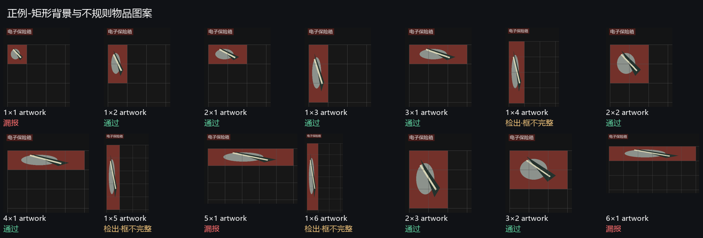
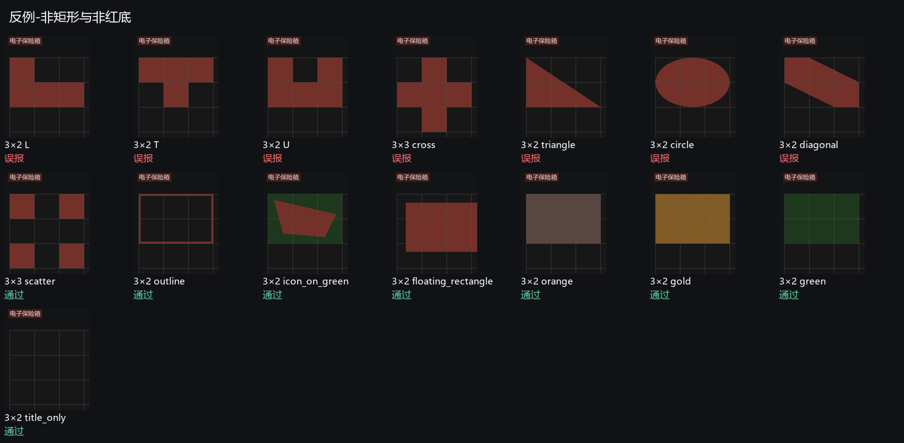

# v0.3.6 两格漏报修复重发

2026-10-05，按用户要求保留 0.3.6 版本号，重新发布同一 Release 的程序与校验文件。已有 0.3.6 用户也需要重新下载并退出旧程序后运行新 exe；停止再开始检测、修改 JSON 都不能更新编译逻辑。

## 原因和修正

横向 2×1 和竖向 1×2 红品的颜色框会因格线/边框稍小于理论两格面积。例如 85 像素格子的 169×84 候选面积为 14196，小于原门限 14450；两种方向均以 size 拒绝，不是颜色或名称问题。

面积门限现在使用与宽高一致的每边 10% 容差：最低面积为 2×0.9²×格子面积。同时将候选宽/格边长、高/格边长分别四舍五入，乘积必须至少为两格，避免单格图案仅凭放宽后的面积通过。槽位边缘对齐、颜色、名称排除与多帧确认保持原规则。

## 验证

- 修改前实际 exe 回放 72 项：横向 24 项与竖向 24 项全部漏报；单格 24 项被拒绝。
- 修改后同样回放：横向 24 项、竖向 24 项全部检出且框 IoU≥0.85；单格 24 项仍被拒绝。覆盖 48/64/85 像素格子、四种红底、纯背景/不规则物品图案。
- 新 Rust 回归额外覆盖两种方向、三档尺寸、1/2/4 像素边框及放大的单格图案；23 项 Rust 测试含本地私有反馈全部通过。柯恩币、笔记本、唱片机、长笛、滑板以及底部观战样本回归通过。
- 八张旧完整游戏截图、HTTP 历史及复核重启、最佳十箱、反馈 ZIP CRC 与无历史导出回归通过。
- 分享包 exe 再回放 72 项通过；发布后公开下载包 SHA-256 与本机包一致。

516 张合成压力测试中正例检出从 216/336 增为 264/336。反例正确排除 96/180，其余 L/T/U、十字、三角、椭圆、斜条的已知误报仍未解决；1 格防护、5/6 格横条门限和竖直长条框截断也仍存在。这不是实际游戏准确率。本次只修复两格面积问题，不宣称全部形状已修复。

回放也发现原散块反例画成 3×2 布局，左右各两个上下相邻红格，实际就是两个完整 1×2 矩形，与两个合法两格物品无法从同一画面区分。保留原始报告及图例；新生成器改用 3×3 四角布局，中间行、列均留空，仍预期不出红，验证真正隔开的单格散块。没有将预期改成检测器输出。

## 重现

```powershell
python tests/two_slots_regression.py --exe native/target/release/ab-red-detect.exe
python tests/synthetic_slots.py --exe native/target/release/ab-red-detect.exe --strict
```

第一条必须成功；第二条仍会以失败退出，记录其它尚未修正的压力测试断言。测试依赖 Pillow，终端用户不需要 Python。

原 version/v0.3.6 快照及旧包保持本地归档；此次重发源码另存 version/v0.3.6-repack-20261005，发布标签更新为对应修复提交。Python 与旧版本快照字节保持不变；升级不改写历史判断。




