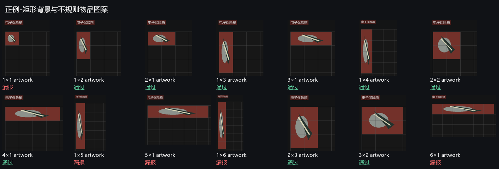

# v0.3.6 竖向三格完整框修复

2026-10-05，在两格修复之后继续按同一 v0.3.6 重发。需要退出旧程序并重新下载 exe；JSON 和停止再开始不能更新编译算法。

## 原因

原面板高度固定为标题字高×18。顶行普通三格可以完整，但较小标题、较大格子或物品位于下方行时，三格红底越过推算底边，导致检测框及历史截图缺少底部，严重时漏报。另有 OCR 字高 14 像素、格边长 85 像素的临界场景，85 比旧六倍上限 84 大一像素，网格测量失败。

## 修正逻辑

先测量网格，再裁剪物品区域。按实测格边长在标题下方寻找网格顶线，并沿格子间距查找连续横向分隔线；每条线要求足够的中性色长度，以及上方至少两条实际竖线交点。首个缺失的行边界就停止，不能直接扫完整工作区或跳过空隙去接下方 HUD。若实测底边高于原标题经验范围的底边，补足面板高度；没有可靠边界时保留原范围。最终裁剪受工作区限制，仍保留原标题屏蔽、颜色、网格对齐、尺寸、排除词及多帧确认。

网格间距上限增加 3 像素测量容差，处理 OCR 字高取整；沿用三条等距长竖线及顶线交点验证。网格数据按当前锚点缓存，正常逐帧不重复测量。Session.panel_rect 同步使用补足后的范围，红品框和保存证据不会各自采用不同底边。

## 验证

| 回归 | 结果 |
| --- | --- |
| 竖向 1×3：48/64/85 像素格子、四种红底、纯背景/不规则物品图案、两种标题字号、起始第 1/2/3 行 | 修复前完整 16/144；最终分享包完整 144/144，框 IoU 全部 1.0 |
| 横向/竖向两格正例和单格反例 | 两格 48/48 检出且框完整，单格 24/24 拒绝 |
| Rust 单元/实际 OCR/本地私有反馈 | 24 项全部通过，包括完整三格、证据范围以及容器外红色 HUD 排除 |
| 小标题、下方行三格的真实窗口截图→标题 OCR→状态门控→记录 | 完整 73×223 物理像素框，DPI 缩放后比例一致；保存面板覆盖底边，正常结算和观战中断正确 |
| 八张旧完整游戏画面及 HTTP 历史/复核持久化 | 通过 |

全部生成图从空白画布绘制，私人反馈和日志只在本机测试。516 项压力测试里已检出但截断的框从 72 项降为 0；仍有其它已知失败，不能当作游戏准确率。

完整裁剪后，五/六格竖条不再用截短片段通过，而是按当前四格单边上限拒绝。因此正例检出为 216/336、反例排除为 96/180；1 格保护、五/六格单行/单列门限和 L/T/U/十字/三角/椭圆/斜条误报仍未解决。2×3、3×2 六格矩形仍可通过。此次修复三格完整框，不放宽其它尺寸或形状规则。

## 重现

```powershell
python tests/vertical_slots_regression.py
python tests/two_slots_regression.py
python tests/native_observer_qa.py --vertical-three
```

前两条需要开发者 Pillow，第三条需要实际 Windows 桌面、Tk 与中文 OCR。终端用户无需 Python。保存的 regression.json 包含每项框 IoU，不能仅以“有红”替代完整定位断言。

新源码快照为 version/v0.3.6-vertical-20261005；初版和两格重发的快照保持不变。发布标签指向最新修复源码，分享 ZIP 与校验文件替换；历史判断和用户自定义设置不改写。


