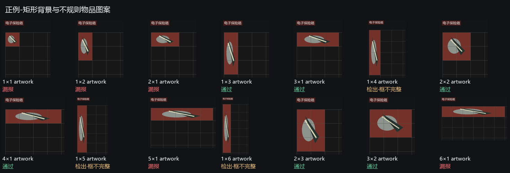
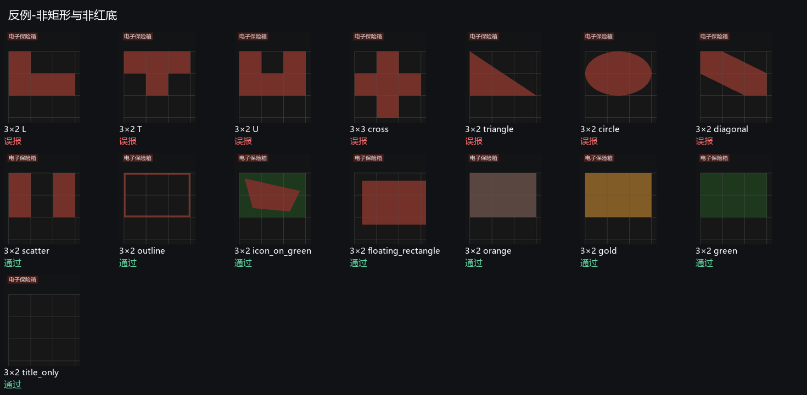

# 1～6 格合成图压力测试

2026-10-05，针对已发布 Rust v0.3.6。此次增加测试与诊断材料，未修改检测算法、exe、Release 或冻结版本快照。全部图片由代码从空白画布生成，没有编辑或发布私人截图。

## 样本与预期

固定种子 20261005，格子边长 48/64/85 像素，四种背景：暗红、普通红、选中红和明亮粉红。正例占用槽位为矩形；前景物品用不规则椭圆/多边形绘制，不将物品图案形状当作槽位背景形状。加入少量固定随机噪声。标题红底随字体缩放，不通过不现实的固定大标题制造干扰。

14 种矩形：1×1、1×2、2×1、1×3、3×1、1×4、2×2、4×1、1×5、5×1、1×6、2×3、3×2、6×1。各三种格子大小、四种颜色、纯背景/含物品图案两种状态，共 336 正例。单格和五/六格长条作为覆盖边界的测试假定，不代表已证明游戏存在所有对应红品；单格正例与当前防柯恩币拖动误报的产品策略有冲突，不能仅依据合成图取消保护。

15 种反例：L、T、U、十字、三角、椭圆、斜条、散块、红轮廓、绿色底上的红色图案、脱离网格的红矩形、棕橙、金色、绿色、仅红标题。每种三种大小、四种颜色，共 180 反例。多数反例外接框占六格；十字额外覆盖五个红格却具有九格外接框的情况。

测试调用实际 exe 的 --panel 路径，使用真实网格测量、颜色/形态学、候选筛选、槽位对齐、多轮确认和 Windows 物品 OCR；保险箱标题锚点由生成器提供。因此不替代截图采集、容器标题 OCR、观战门控和真实游戏回归。

## v0.3.6 实际结果

| 指标 | 结果 |
| --- | --- |
| 总样本 | 516 |
| 正例检出 | 216 / 336 |
| 反例排除 | 96 / 180 |
| 判定不符 | 204 |
| 已检出但框覆盖不完整 | 72（与判定不符分开统计） |

这不是游戏真实准确率估计，而是按构造条件均匀覆盖的规则压力测试。

- 1×1 的 24 项被 size 拒绝：当前门限要求至少两格。这是原防单格误报策略，并非颜色判定失败。
- 1×2 与 2×1 各 24 项被 size 拒绝：85 像素格线下两格红底实际候选是 169×84，面积小于 2×85²；当前面积门限没有容忍格线。三格同色样本可通过，排除了颜色/文字差异解释。
- 5×1 与 6×1 各 24 项被 aspect/size 拒绝：当前单边上限四格，宽高比上限 4.5。
- L、T、U、十字、三角、椭圆、斜条共 84 项误报：它们的矩形外接框可以对齐网格，但红色背景并不矩形。外接框对齐不能证明轮廓矩形。
- 1×4、1×5、1×6 共 72 项已检出但矩形 IoU<0.85：标题字高推算的面板截断了竖直长条。检出与完整定位分别断言，画廊用黄色标注框不完整。

后续修正需要验证完整稀有度背景的矩形结构，保留被物品图案/提示遮住部分背景的真实正例；同时处理格线面积容差和面板范围。只要求物品图标矩形、只提高填充率、或简单放宽单格门限都会引入新的误杀/误报风险。

## 运行和检查

Windows 开发环境需要 Pillow（仅测试依赖）。在源码根目录运行：

```powershell
python tests/synthetic_slots.py --exe native/target/release/ab-red-detect.exe --strict
```

当前 v0.3.6 预期退出码为 1，表示上述检测断言失败，不是脚本执行异常。不加 --strict 可仅生成报告。默认生成目录 tests/synthetic-slots 已加入 Git 忽略；包含 cases.json、每张 PNG 的 SHA-256、results.json、候选拒绝原因、框 IoU 和两张画廊。未来修改算法后用相同种子和明确的正负标签回放，不能将预期改成当前实现结果。




